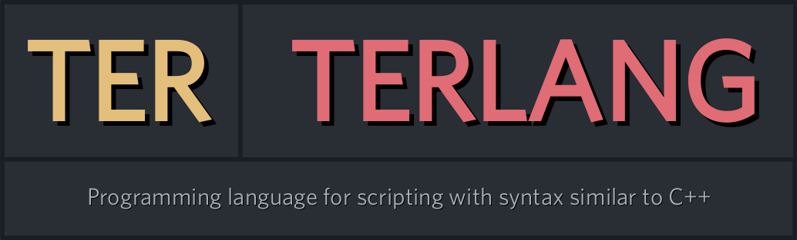

# [Ter/Terlang](./README.md)
> Programming language for scripting with syntax similar to C++

 

---

## Summary
1. [Building and Installing on UNIX-style systems](#building-on-unix-style-systems)
2. [Building and Installing on Windows](#building-and-installing-on-windows)
3. [Only installing on Windows or Ubuntu](#only-installing-on-windows-or-ubuntu)
4. [Using](#using)
5. [Tutorials](#tutorials)
6. [Extensions and LICENSE](#extensions-and-license)

---

### Dependencies
+ [GNU GCC](https://gcc.gnu.org/), [Clang](https://clang.llvm.org/) or [MSVC](https://learn.microsoft.com/en-us/cpp/?view=msvc-170)
+ [CMake](https://cmake.org/)
> C++23

### Building on UNIX-style systems
> macOS, GNU/Linux, BSD-Like, Haiku and others.

```bash
git clone https://github.com/terroo/terlang
cd terlang
cmake -B build .
cmake --build build
sudo cmake --install build
```

REPL:
> To test the `ter` command.
```cpp
$ ter
ter> output(args())
Ter/Terlang VERSION: 0.0.1
ter> exit
```

---

### Building and Installing on Windows
With MSVC!
> Open PowerShell (Run as Administrator) from the Windows Start Menu

```bash
git clone https://github.com/terroo/terlang
cd terlang\
cmake -B build .
cmake --build build

# Create destination folders and subfolders
New-Item -Path "C:\Program Files\Terlang\bin" -ItemType Directory -Force

# Move to destination folder
Move-Item -Path "build\Debug\ter.exe" -Destination "C:\Program Files\Terlang\bin\ter.exe"

# Create an environment variable for system "Path"
[System.Environment]::SetEnvironmentVariable("Path", $env:Path + ";C:\Program Files\Terlang\bin", [System.EnvironmentVariableTarget]::Machine)
```

Close PowerShell, then reopen and run:
> To test the `ter` command.
```cpp
prompt> ter
ter> output(args())
Ter/Terlang VERSION: 0.0.1
ter> exit
```

---

### Only installing on Windows or Ubuntu

Windows:
```bash
Invoke-WebRequest -Uri "https://github.com/terroo/terlang/releases/download/v0.0.1/terlang-windows-0.0.1.zip"
```
+ Unzip
+ Create folders and subfolders: `C:\Program Files\Terlang\bin`
+ Move the `.exe` to the `bin\` subfolder
+ Add the path as an environment variable to just the `ter` command in *PowerShell* or *CMD*

Ubuntu:
```bash
wget https://github.com/terroo/terlang/releases/download/v0.0.1/terlang-ubuntu-24-04-0.0.1.zip
unzip terlang-ubuntu-24-04-0.0.1.zip
sudo mv ter /usr/local/bin
```

And test:
```cpp
$ ter
ter> output(args())
Ter/Terlang VERSION: 0.0.1
ter> exit
```

---

## Using
> `vim hello.ter`

#### 01. Hello, World!
```cpp
// Comment line
auto hello = "Hello, Terlang! 😃 ";
output(hello);
/*
  Multiline
  comments
*/
```
> Semicolon is optional: `auto hello = "Hello, Terlang!"`. Literally skipping the line: `out("Hello\n")`

Run:
```bash
ter hello.ter
```
> Output: `Hello, Terlang! 😃`

#### 02. Arrays
```cpp
auto list = {13, 2, 8, 4, 17, 12, 11, 9};
output(list[6]); // 11
```

#### 03. Loops
```cpp
for(auto i = 0; i < 5; ++i){ // Or i++
  out(to_string(i) + " | ")
}
out("\n")
// 0 | 1 | 2 | 3 | 4 |


auto i = 0;
while(i < 5){
  out(to_string(i) + " | ")
  ++i;
}
out("\n")
// 0 | 1 | 2 | 3 | 4 |
```

#### 05. Includes

> `main.ter`
```cpp
include("./library.ter")
output(value); // 18
```

> `library.ter`
```cpp
auto value = 18;
```

#### 06. Functions
```cpp
set print(str){
  output(str);
}

set add(x, y){
  return x + y;
}

set increment(a){
  return ++a;
}

print("My content"); // My content
output(add(3, 9)); // 12

auto result = increment(6);
output(result); // 7
```

#### 07. Classes
```cpp
class Animal {
  cat(name){
    output("Cat name is: " + name);
  }

  dog(){
    output("I am dog!");
  }

  descAnimal(human){
    return "Human: " + human;
  }
}

Animal().cat("Bob");

auto obj = Animal();
obj.dog();

output(obj.descAnimal("Peter"));
```
> Output:
```bash
Cat name is: Bob
I am dog!
Human: Peter
```

#### 08. Builtin Functions
```cpp
// Rand number
auto num = rand(5, 15);
output(num) // Number between 5 and 15

// Clock
auto myclock = clock();
output(myclock); // Ex.: 1732022610.561000

// Environment variables
auto home = getenv("HOME");
output(home); // Ex.: /home/user

auto shell = getenv("SHELL")
output(shell); // Ex.: /bin/bash

// Exec shell
exec("ls")

// Compiling C++ code
exec("g++ main.cpp")
exec("./a.out")

// Temporary version
auto version = args();
output(version); // Ex.: Ter/Terlang VERSION: 0.0.1
```

---

## Run from command line
```bash
ter -e 'output("Hello, Word!")'
ter -e 'auto x = 9 output(x)'
ter -e 'auto var = 42;out(to_string(var) + "\n")'
ter -e "$(cat build.ter)"
```

---

#### Using [Emscripten](https://emscripten.org/)
Compiling:
```bash
emmake -B web .
cd web
emmake make
```

Testing:
```bash
cd web/
node ter.js -e 'output("Hello, Word!")'
node ter.js -e 'auto var = 42;out(to_string(var) + "\n")'
node ter.js -e "$(cat build.ter)"
```

---

## Tutorials
From [video](https://youtu.be/0sKCWJawDZ8).

---

## Extensions and LICENSE
[Syntax highlight for Vim](https://github.com/terroo/ter-vim)

[Syntax highlight for Neovim](https://github.com/terroo/ter-vim)

Syntax highlight for VS Code:
> Comming soon!

---

[LICENSE GNU GPLv3](./LICENSE)
